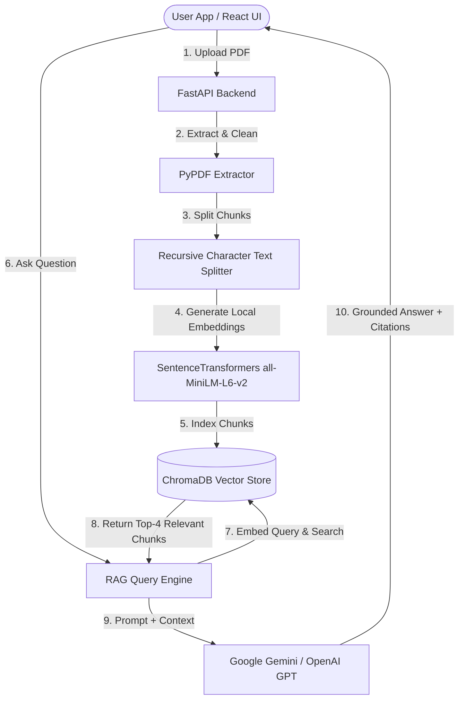

# DocMind AI – Chat with Your Documents 🧠📄

**DocMind AI** is a production-grade, full-stack Generative AI application that empowers users to upload PDF documents and ask questions in real-time using **Retrieval-Augmented Generation (RAG)**. 

Built with **FastAPI**, **React (TypeScript + Tailwind CSS)**, **LangChain**, **ChromaDB**, and **SentenceTransformers**, it automatically extracts PDF content, splits text into semantic chunks, indexes vector embeddings, and generates accurate, grounded answers backed by **Google Gemini** or **OpenAI GPT** with exact page-level source citations.

---

## 🚀 Key Features

- 🔒 **User Authentication & Security**: JWT-based session security, Bcrypt password hashing, and user-isolated multi-tenant data storage.
- 📄 **PDF Processing & Chunking**: Automatic text extraction using `PyPDF`, noise cleaning, and smart text splitting with `RecursiveCharacterTextSplitter`.
- ⚡ **Local Vector Store & Embeddings**: Local vector embedding generation via `SentenceTransformers` (`all-MiniLM-L6-v2`) and persistent storage in **ChromaDB**.
- 🤖 **Flexible LLM Provider**: Dynamic environment selection between **Google Gemini** (`gemini-1.5-flash`) and **OpenAI** (`gpt-4o-mini`).
- 📌 **Exact Source Citations**: Every AI response displays interactive source chips containing the source document name, page number, and text snippet.
- ⚙️ **Configurable Generation Settings**: Real-time user control over LLM `temperature` and `max_tokens`.
- 🎨 **Modern Glassmorphic UI**: Sleek dark mode dashboard built with React 18, TypeScript, Tailwind CSS, and Lucide icons.

---

## 🏗️ Architecture & RAG Workflow



### How RAG Works in DocMind AI
1. **Document Ingestion**: When a PDF is uploaded, text is extracted page by page while tracking page numbers.
2. **Text Chunking**: The text is split into chunks of `800` characters with `150` character overlap to preserve semantic context across chunk boundaries.
3. **Embedding Generation**: The local `all-MiniLM-L6-v2` model converts text chunks into 384-dimensional dense vector representations.
4. **Vector Indexing**: Vector embeddings and metadata (`user_id`, `document_id`, `page_number`, `filename`) are indexed in ChromaDB.
5. **Context Retrieval**: When a user asks a question, ChromaDB retrieves the **Top 4** most semantically similar chunks belonging to that specific user.
6. **LLM Generation**: The retrieved chunks are injected into a grounded system prompt sent to the LLM (Gemini or OpenAI), ensuring accurate answers without hallucination.

---

## 🛠️ Tech Stack

### Backend
- **Framework**: FastAPI (Python 3.10+)
- **ORMs & Database**: SQLAlchemy, SQLite
- **Security & Auth**: PyJWT, Passlib (Bcrypt)
- **AI & RAG**: LangChain, Google Gemini API, OpenAI API
- **Embeddings**: SentenceTransformers (`all-MiniLM-L6-v2`)
- **Vector Database**: ChromaDB (Persistent)
- **PDF Extraction**: PyPDF

### Frontend
- **Framework**: React 18 with TypeScript (Vite)
- **Styling**: Tailwind CSS (Dark Mode Glassmorphism)
- **Icons**: Lucide React
- **HTTP Client**: Axios with JWT Request Interceptor
- **Routing**: React Router v6

---

## 📁 Project Structure

```
DocMind AI – Chat with Your Documents/
├── backend/
│   ├── app/
│   │   ├── api/
│   │   │   ├── auth.py          # Signup, Login, Profile endpoints
│   │   │   ├── documents.py     # Upload, List, Search, Delete endpoints
│   │   │   ├── chat.py          # RAG query & chat history endpoints
│   │   │   └── settings.py      # Temperature & token limits endpoints
│   │   ├── core/
│   │   │   ├── config.py        # Pydantic environment configuration
│   │   │   ├── database.py      # SQLite connection setup
│   │   │   └── security.py      # Bcrypt & JWT security helpers
│   │   ├── models/
│   │   │   └── db.py            # SQLAlchemy database models
│   │   ├── schemas/
│   │   │   └── schemas.py       # Pydantic schemas
│   │   ├── services/
│   │   │   ├── pdf_service.py   # PDF text extraction & chunking
│   │   │   ├── vector_store.py  # ChromaDB & embedding manager
│   │   │   └── rag_service.py   # RAG query execution & LLM handler
│   │   └── main.py              # FastAPI app initialization
│   ├── requirements.txt
│   └── .env
├── frontend/
│   ├── src/
│   │   ├── components/          # Navbar, ProtectedRoute, Modals
│   │   ├── context/             # AuthContext
│   │   ├── pages/               # Login, Register, Dashboard, Chat
│   │   ├── services/            # Axios API client
│   │   ├── types/               # TypeScript interfaces
│   │   ├── App.tsx
│   │   └── index.css            # Glassmorphism CSS styles
│   ├── package.json
│   └── vite.config.ts
├── database/                    # SQLite & ChromaDB storage
├── uploads/                     # Server file uploads
└── README.md
```

---

## 💻 Installation & Setup

### 1. Prerequisites
- Python 3.10 or higher
- Node.js 18 or higher
- Git

### 2. Backend Setup
```bash
# 1. Clone repository & navigate to backend
cd backend

# 2. Create virtual environment
python -m venv venv
# On Windows PowerShell:
.\venv\Scripts\Activate.ps1

# 3. Install dependencies
pip install -r requirements.txt

# 4. Configure environment variables in backend/.env
# Example .env contents:
# LLM_PROVIDER="gemini"
# GOOGLE_API_KEY="your-gemini-api-key"

# 5. Start FastAPI server
uvicorn app.main:app --reload --port 8000
```
Backend server will start at `http://127.0.0.1:8000`. Swagger API docs available at `http://127.0.0.1:8000/docs`.

### 3. Frontend Setup
```bash
# 1. Open a new terminal & navigate to frontend
cd frontend

# 2. Install dependencies
npm install

# 3. Start Vite dev server
npm run dev
```
Frontend application will be available at `http://localhost:5173`.

---

## 📝 Resume Description (For Freshers)

**DocMind AI – Full-Stack Generative AI Document Chat Application**
*Tech Stack: FastAPI, Python, React, TypeScript, Tailwind CSS, LangChain, ChromaDB, SentenceTransformers, Gemini/OpenAI API*
- Built a full-stack RAG (Retrieval-Augmented Generation) application allowing users to upload PDF documents and ask questions with exact page-level source citations.
- Engineered a document ingestion pipeline using `PyPDF` and `RecursiveCharacterTextSplitter`, generating 384-dimensional dense vector embeddings with `all-MiniLM-L6-v2`.
- Integrated `ChromaDB` for persistent vector search, retrieving top 4 contextually relevant chunks filtered by user tenant ID.
- Implemented JWT authentication, password hashing with Bcrypt, and a responsive glassmorphic UI in React with TypeScript.

---

## 🎓 Interview Q&A Preparation Guide for Freshers

### Q1: What is RAG and why did you use it instead of fine-tuning an LLM?
> **Answer**: RAG (Retrieval-Augmented Generation) enhances LLM responses by retrieving relevant external facts from a vector database before passing them to the model. I chose RAG over fine-tuning because fine-tuning is expensive, time-consuming, and can lead to catastrophic forgetting. RAG allows real-time document updates, guarantees up-to-date responses, provides verifiable source page citations, and prevents LLM hallucinations by grounding answers strictly in retrieved context.

### Q2: How does vector search work in your ChromaDB setup?
> **Answer**: When text chunks are indexed, SentenceTransformers converts text strings into numerical vector embeddings (384 float dimensions). When a user asks a question, the query is converted into an embedding using the exact same model. ChromaDB then computes cosine similarity or Euclidean distance between the query vector and document chunk vectors, returning the top-4 nearest neighbors.

### Q3: How did you ensure user privacy and tenant isolation in vector storage?
> **Answer**: Every chunk indexed in ChromaDB includes metadata attributes (`user_id`, `document_id`, `filename`, `page_number`). During retrieval queries, I pass a strict metadata filter `{"user_id": current_user.id}` to ChromaDB. This guarantees that users can only search across their own uploaded documents.

---

## 📄 License
MIT License. Created as a portfolio project for AI Engineer & GenAI Developer roles.
